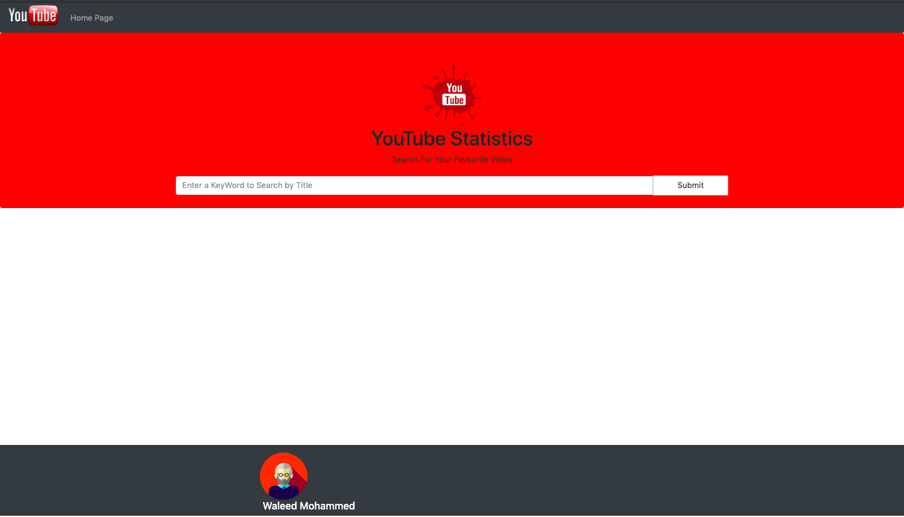
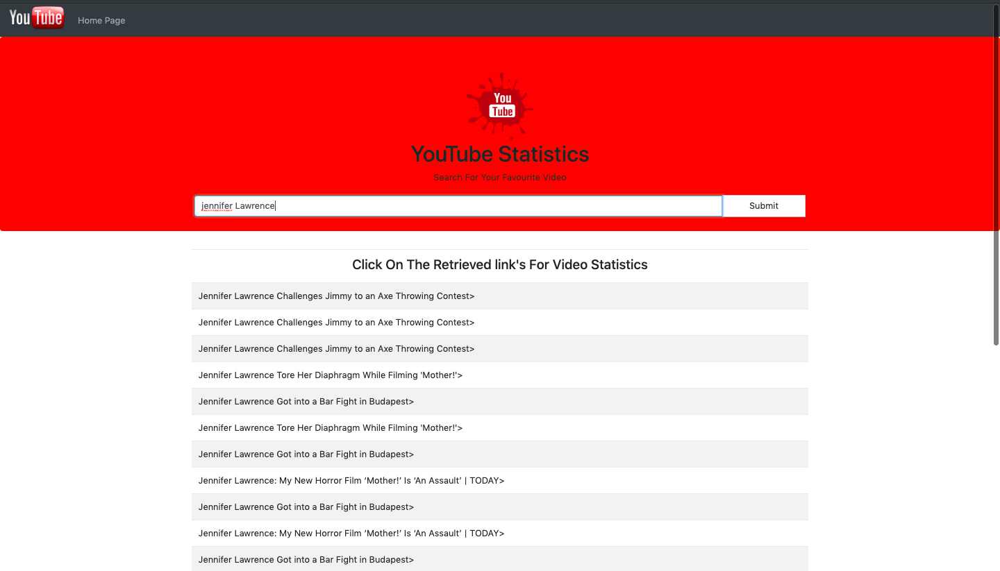
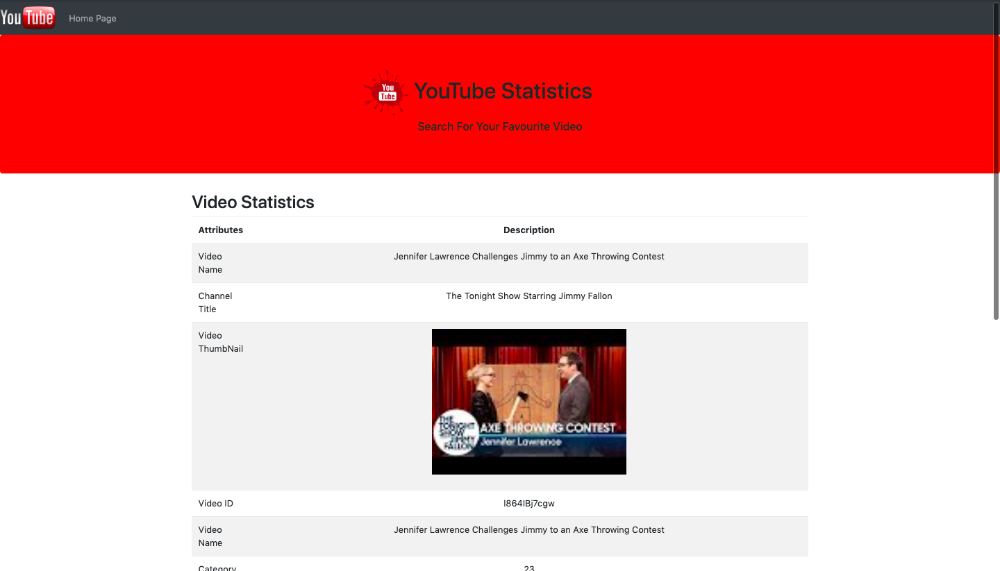
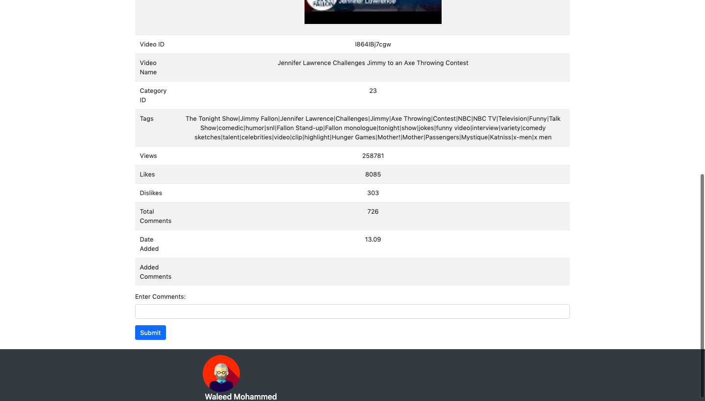

# YouTube Statistics

# Project Summary:

In this project, I built a Web API using 4 components of MEAN Stack technology which is MongoDB, ExpressJS, and NodeJS. 
In this, I have used one datasets which Youtube statistics containing around 8000 documents and consist of 11 attributes and has been taken from the Kaggle website. 
The application basically allows the user to Search from thousands of youtube videos to check their statistics also the user can add his own comments to any particular video.

# Requirement to run the project:

	1.	MongoDB 
	2.	NodeJS
	3.	ExpressJS
	4.	Grid Fs

# Instructions:

	1. Open terminal and go to the directory where the YouTube project is saved and run the following commands  node server.js

	2. Once the connection is obtained open any browser and type localhost:4000 and press enter. Now, follow the onscreen directions and proceed.

			
# Output Interpretation:
		On giving input by title to the search bar the number of videos list is retrieved based on the provided input and on clicking on any of the retrieved video its statistics will be displayed. 
		The user is also allowed to add his/her own comments on any particular video.
		

		

  
  

  

  

# References:
- https://docs.mongodb.com/
- https://docs.mongodb.com/manual/core/gridfs/
- https://nodejs.org/en/docs/
- https://expressjs.com/en/api.html
- https://www.w3schools.com/

